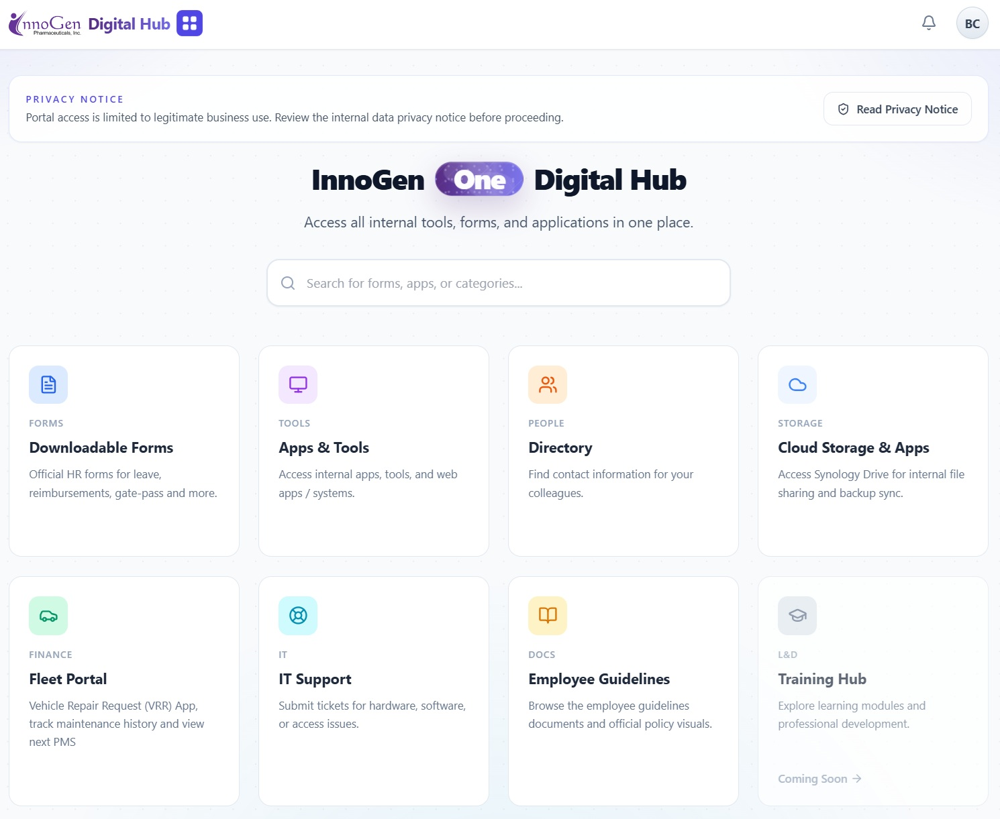

# 🏢 InnoGen One • Digital Hub
**Unified Enterprise Resource Planning (ERP) Gateway & Employee Directory**

[](https://developer.mozilla.org/en-US/docs/Web/HTML)
[](https://tailwindcss.com/)
[](https://developer.mozilla.org/en-US/docs/Web/JavaScript)
[](https://fastapi.tiangolo.com/)
[](https://nginx.org/)
[](https://redis.io/)
[](https://www.docker.com/)

<p align="center">
  
</p>

## 🛠 Tech Stack

| Category | Tools |
| :--- | :--- |
| **Frontend** | **Tailwind CSS** (Utility-first UI), HTML5, Lucide Icons |
| **Logic** | Vanilla JavaScript (Dynamic Search & Filter Engines) |
| **Backend** | FastAPI + Uvicorn |
| **Reverse Proxy** | NGINX |
| **Session Store** | Redis (TTL-based sessions) |
| **Containerization** | Docker + Docker Compose |
| **Data Handling** | Asynchronous CSV/TXT/JSON parsing + static file serving |
| **Architecture** | Static-first hub served via FastAPI, protected by SSO, optimized for low-latency internal use |
| **Security** | SSO-based authentication, HTTP-only session cookies, audit-friendly request logging |

---

## 🎯 Project Overview
The **InnoGen One • Digital Hub** serves as the "Digital Nervous System" for InnoGen. It is a high-performance, searchable gateway designed to eliminate information silos. It provides employees with a single point of access for corporate tools, IT support, and verified directory data.

This version is already integrated with **FastAPI + NGINX + Redis** and an external **SSO** provider:
- `/login` starts the SSO flow.
- `/sso-callback` verifies the SSO session.
- `POST /api/auth/session` creates a portal session stored in Redis and sets a hub cookie.

### 🌟 High-Value Business Logic
* **Centralized Resource Management:** Aggregates disparate company resources into a unified, intuitive dashboard.
* **Intelligent Search Engine:** Features a real-time, searchable directory for corporate emails, local extensions, and mobile numbers.
* **IT Support Integration:** Streamlined support cards with automated modal prompts and secure `mailto:` fallback protocols.

---

## 🚀 Key Professional Capabilities

### 🛡️ Privacy & Data Integrity
* **Anti-Bulk Export Logic:** UI-level restrictions on directory pages to discourage unauthorized bulk copying/selection of sensitive contact lists.
* **Controlled Distribution:** Designed for internal use; the backend can enforce authentication before serving content.
* **Audit-Ready:** JSON-formatted access/audit logs and Redis-backed sessions with configurable TTL.

### 🎨 Modern UI/UX Design
* **Responsive Hub Cards:** Mobile-friendly, card-based interface that supports office desktops and field-team devices.
* **Dynamic Content Loading:** Parses selected internal resources on the fly (CSV/TXT) so directory pages stay current with the source data.

---

## ⚙️ Directory Structure & Run Guide

### Project Layout
- `app/main.py`: FastAPI app (SSO login + session + static routing).
- `index.html`: The core landing hub.
- `pages/`: Independent modules for Email, Local Numbers, and contact lists.
- `assets/`: Frontend assets (CSS/JS/images).
- `resources/`: Internal documents and data files.
- `nginx/default.conf`: Reverse proxy config for the containerized NGINX.

### Local Deployment (Docker)
```bash
docker compose up -d --build
```

Access the portal at: `http://localhost:8521/`

---

## 📜 License & Intellectual Property
**Copyright (c) 2026 Benedic Cater / InnoGen Pharmaceuticals Inc.**

**All Rights Reserved.**
This repository is published for **portfolio review and technical demonstration purposes only.**

**Strict Restrictions:**
- **No Reproduction:** No part of this code may be copied, modified, or distributed.
- **Brand Protection:** Use of the "InnoGen" name, branding, or logos is strictly prohibited.
- **Data Privacy:** Use of any proprietary data or business logic contained herein for commercial or personal projects is strictly prohibited.

_For professional inquiries or permission requests, please contact Benedic Cater._
